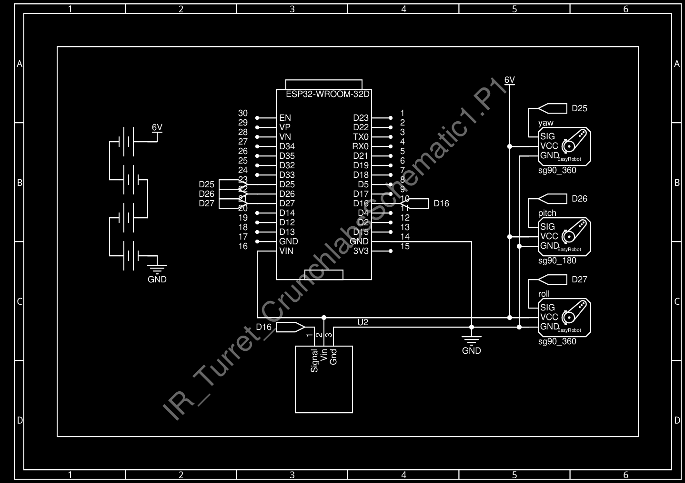
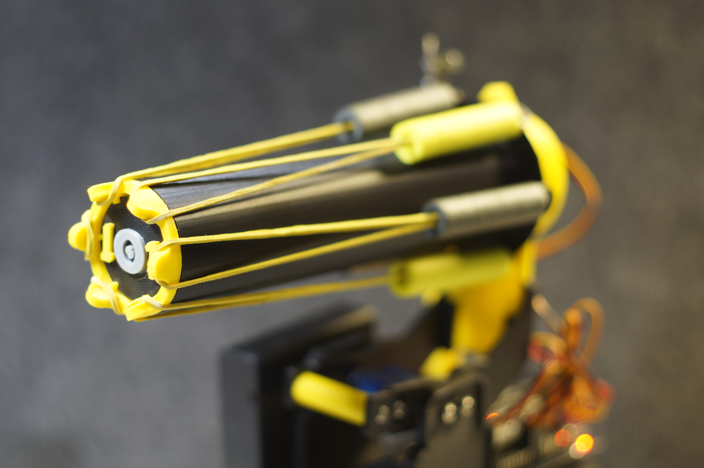

# IR Turret Crunchlabs

This is my personal project, IR Turret based from hackpack (Crunchlabs)

It includes electronics, 3D printed parts, schematics, etc

## 📦 Project Contents

- `code/`: Arduino code (multiple versions)
- `schematics/`: Schematics, diagrams, and professional circuits
- `3d_models/`: 3D printed designs
- `photos/`: High quality photos of the project
- `libraries/`: Arduino libraries used in the code
- `components/`: Full Component List

## 🕹️ Control System

This robot can be controlled using:
- IR Controller, same as official version.

## 🔩 Full Component List

You can find a complete, organized list of all electronic, mechanical, and auxiliary components used in this project in the spreadsheet below:

📄 [CrunchLabs IR Turret io1 ver. Components Documentation](CrunchLabs_IR_Turret_io1_ver._Components_Documentation.xlsx)

This table includes:
- Quantity and part numbers  
- Technical specifications  
- Purpose in project  
- Reason for selection  
- Reference images  

Also i made a schematic with all the conections

## 🛠️ Tools and Platforms Used

Here’s a list of the main tools and platforms I used throughout the WALL·E project:

- **Fusion 360** – Designed 3D parts of the robot and exported STL files for 3D printing.
- **Fritzing** – Simulated circuits and verified wiring before building the physical prototype.
- **EasyEDA** – Created professional circuit schematics and organized the wiring logic.
- **Arduino IDE** – Developed and uploaded firmware to the ESP32 microcontroller.
- **GitHub** – Used for version control, documentation, and collaboration.
- **OrcaSlicer** – Used slicing all my 3d printabled parts.

## 📸 Preview

## 🧠 Author

Created by: **Nicolás (io1)**  
